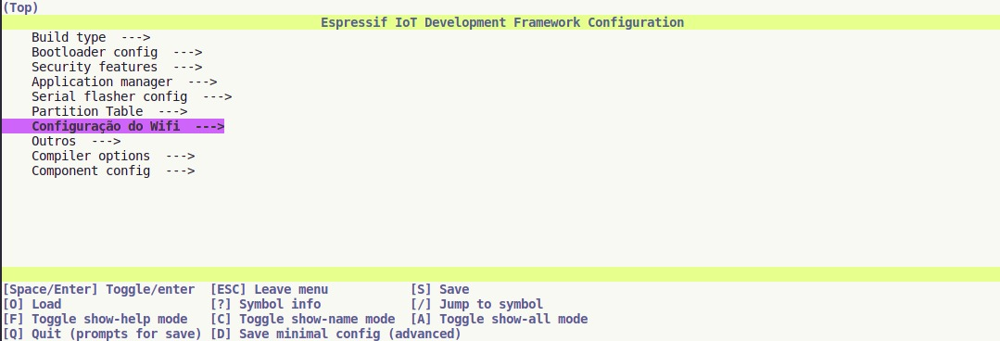
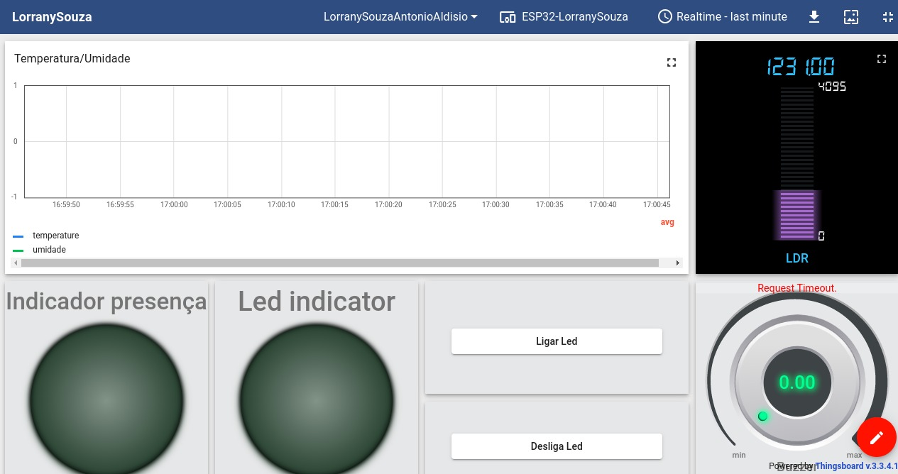
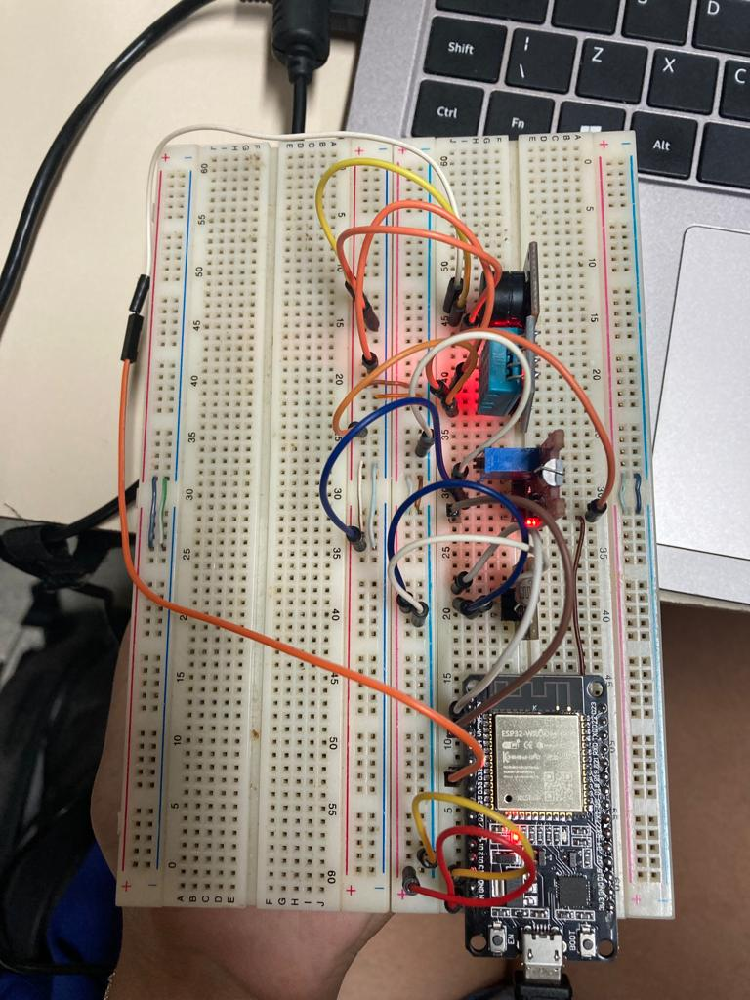

# Trabalho FInal  - Fundamentos de Sistemas Embarcados

O presente projeto possui como finalidade a criação de um sistema automatização de um quarto de um bebê para monitoramento do mesmo, para isso ele conta com: sensor de temperatura, buzzer, sensor LDR, Led e sensor de toque.  Segue o link para acesso ao enunciado completo do projeto da disciplina: [Trabalho Final ](https://gitlab.com/fse_fga/trabalhos-2022_2/trabalho-final-2022-2)  


## Dados do Aluno

| Nome                          | Matrícula  | Turma          |
| ----------------------------- | ---------- | -------------- |
| Antonio Aldisio               | 20/2028211 | 12:00 às 13:50 |
| Lorrany Oliveira Souza        | 18/0113992 | 10:00 às 11:50 |

## Dependências

- PlatformIO

## Como Executar

#### 1. Clone ou baixe os arquivos do repositório.

#### 2. Abra o projeto com a extensão PlatformIO.

#### 3. Faça o Build

#### 4. Faça o Upload

#### 5. Selecione o Serial Monitor (para monitorar o que acontece com a placa)

## Como Configurar o WiFi

Rode o comando abaixo no terminal do PlatformIO: 
```bash
pio run -t menuconfig
```
Irá aparecer uma tela como a da imagem a seguir, selecione Configuração do Wifi e preencha com as informações do seu Wifi.



## Dashboard 
Nome: LorranySouzaAntonioAldisio



## Protoboard da placa com sensores
Imagem da placa conectada com os sensores: touch, temperatura, buzzer e LDR.




## Vídeo da apresentação

[Apresentação dash e protoboard](https://www.youtube.com/watch?v=OcYnsoa_Hao)

[Apresentação do código](https://www.youtube.com/watch?v=yVMHrjBJiEo)